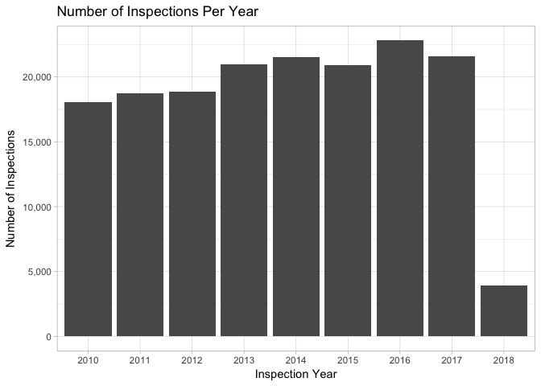
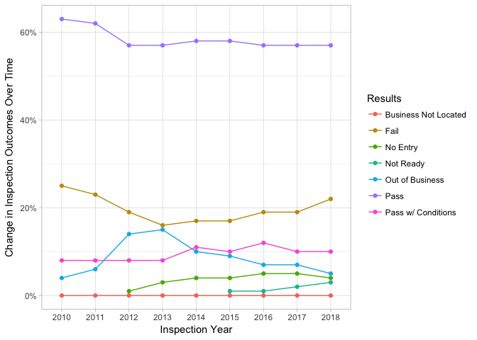
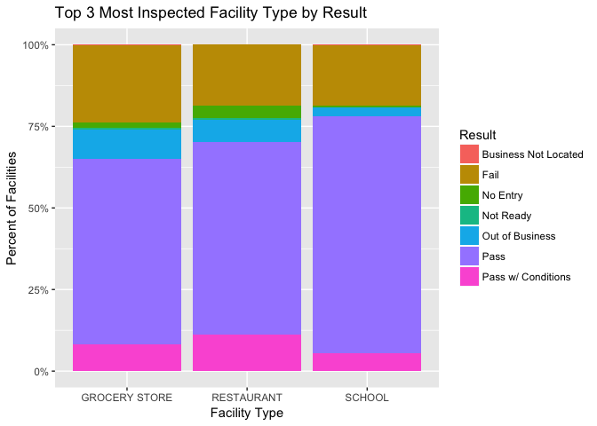
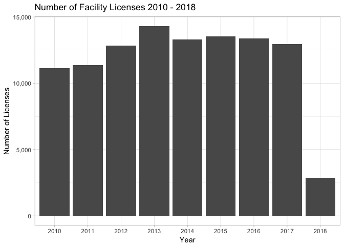

The ‘Food Inspections’ data set is curated as part of the City of
Chicago’s Data Portal and is cataloged in the Health and Human Services
section. The data set was created from inspections of restaurants and
other food establishments throughout Chicago, starting in June of 2010
and continues to present day, with its last update being April 15, 2018.
The data was produced using the Chicago Department of Public Health’s
Food Protection Program that uses the department’s standard procedure
for inspection and evaluation. The evaluations, maintained in a
database, is approved by the State of Illinois Licensed Environmental
Health Practitioner (LEHP).

Projects that use this data source are:

[Food Inspections
Project](https://chicago.github.io/food-inspections-evaluation/)
[Chicago Department of Public
Health](https://github.com/Chicago/food-inspections-evaluation)

Articles:

[Chicago’s Data Powered Recipe for Food
Safety](http://www.governing.com/blogs/bfc/gov-chicago-data-analytics-restaurant-inspections-food-safety.html)

    ## 
    ## 
    ## |Food Inspections Data Set Summary Statistics     |2010                           |2011                           |2013                           |2013                           |2014                           |2015                           |2016                           |2017                           |2018                          |
    ## |:------------------------------------------------|:------------------------------|:------------------------------|:------------------------------|:------------------------------|:------------------------------|:------------------------------|:------------------------------|:------------------------------|:-----------------------------|
    ## |**Results**                                      |&nbsp;&nbsp;                   |&nbsp;&nbsp;                   |&nbsp;&nbsp;                   |&nbsp;&nbsp;                   |&nbsp;&nbsp;                   |&nbsp;&nbsp;                   |&nbsp;&nbsp;                   |&nbsp;&nbsp;                   |&nbsp;&nbsp;                  |
    ## |&nbsp;&nbsp; Pass                                |63.39% (n = 18,068)            |62.47% (n = 18,750)            |57.48% (n = 18,866)            |57.10% (n = 20,950)            |58.46% (n = 21,540)            |57.99% (n = 20,912)            |56.66% (n = 22,816)            |56.69% (n = 21,584)            |56.62% (n = 3,926)            |
    ## |&nbsp;&nbsp; Pass w/ Conditions                  |7.89% (n = 18,068)             |8.09% (n = 18,750)             |8.12% (n = 18,866)             |8.38% (n = 20,950)             |10.72% (n = 21,540)            |10.32% (n = 20,912)            |11.54% (n = 22,816)            |9.91% (n = 21,584)             |9.88% (n = 3,926)             |
    ## |&nbsp;&nbsp; No Entry                            |0.00% (n = 18,068)             |0.00% (n = 18,750)             |1.30% (n = 18,866)             |3.38% (n = 20,950)             |3.53% (n = 21,540)             |4.24% (n = 20,912)             |4.68% (n = 22,816)             |5.37% (n = 21,584)             |3.54% (n = 3,926)             |
    ## |&nbsp;&nbsp; Fail                                |24.93% (n = 18,068)            |23.24% (n = 18,750)            |19.30% (n = 18,866)            |15.99% (n = 20,950)            |17.27% (n = 21,540)            |17.25% (n = 20,912)            |18.84% (n = 22,816)            |19.08% (n = 21,584)            |21.55% (n = 3,926)            |
    ## |&nbsp;&nbsp; Not Ready                           |0.00% (n = 18,068)             |0.00% (n = 18,750)             |0.00% (n = 18,866)             |0.00% (n = 20,950)             |0.00% (n = 21,540)             |1.19% (n = 20,912)             |1.49% (n = 22,816)             |1.96% (n = 21,584)             |2.93% (n = 3,926)             |
    ## |&nbsp;&nbsp; Out of Business                     |3.74% (n = 18,068)             |6.12% (n = 18,750)             |13.74% (n = 18,866)            |15.14% (n = 20,950)            |9.98% (n = 21,540)             |8.99% (n = 20,912)             |6.77% (n = 22,816)             |6.97% (n = 21,584)             |5.45% (n = 3,926)             |
    ## |**Risk**                                         |&nbsp;&nbsp;                   |&nbsp;&nbsp;                   |&nbsp;&nbsp;                   |&nbsp;&nbsp;                   |&nbsp;&nbsp;                   |&nbsp;&nbsp;                   |&nbsp;&nbsp;                   |&nbsp;&nbsp;                   |&nbsp;&nbsp;                  |
    ## |&nbsp;&nbsp; Risk 1 (High)                       |66.13% (n = 18,047non-missing) |65.11% (n = 18,741non-missing) |65.77% (n = 18,858non-missing) |67.62% (n = 20,941non-missing) |71.10% (n = 21,536non-missing) |72.47% (n = 20,911non-missing) |74.74% (n = 22,809non-missing) |75.68% (n = 21,579non-missing) |77.50% (n = 3,924non-missing) |
    ## |&nbsp;&nbsp; Risk 2 (Medium)                     |21.88% (n = 18,047non-missing) |22.69% (n = 18,741non-missing) |20.06% (n = 18,858non-missing) |21.63% (n = 20,941non-missing) |20.08% (n = 21,536non-missing) |20.43% (n = 20,911non-missing) |20.31% (n = 22,809non-missing) |17.76% (n = 21,579non-missing) |14.45% (n = 3,924non-missing) |
    ## |&nbsp;&nbsp; Risk 3 (Low)                        |11.99% (n = 18,047non-missing) |12.19% (n = 18,741non-missing) |14.16% (n = 18,858non-missing) |10.73% (n = 20,941non-missing) |8.80% (n = 21,536non-missing)  |7.10% (n = 20,911non-missing)  |4.95% (n = 22,809non-missing)  |6.53% (n = 21,579non-missing)  |7.90% (n = 3,924non-missing)  |
    ## |**Inspections**                                  |&nbsp;&nbsp;                   |&nbsp;&nbsp;                   |&nbsp;&nbsp;                   |&nbsp;&nbsp;                   |&nbsp;&nbsp;                   |&nbsp;&nbsp;                   |&nbsp;&nbsp;                   |&nbsp;&nbsp;                   |&nbsp;&nbsp;                  |
    ## |&nbsp;&nbsp; Total Inspections                   |18068                          |18750                          |18866                          |20950                          |21540                          |20912                          |22816                          |21584                          |3926                          |
    ## |&nbsp;&nbsp; Number of Different Inspection Type |79                             |41                             |29                             |24                             |19                             |15                             |15                             |15                             |12                            |
    ## |**Facilities**                                   |&nbsp;&nbsp;                   |&nbsp;&nbsp;                   |&nbsp;&nbsp;                   |&nbsp;&nbsp;                   |&nbsp;&nbsp;                   |&nbsp;&nbsp;                   |&nbsp;&nbsp;                   |&nbsp;&nbsp;                   |&nbsp;&nbsp;                  |
    ## |&nbsp;&nbsp; Number of Facilities                |9454                           |9672                           |10746                          |12129                          |11354                          |11433                          |11264                          |10849                          |2482                          |
    ## |&nbsp;&nbsp; Number of Facility Types            |180                            |167                            |172                            |186                            |163                            |193                            |180                            |180                            |53                            |
    ## |**Geography**                                    |&nbsp;&nbsp;                   |&nbsp;&nbsp;                   |&nbsp;&nbsp;                   |&nbsp;&nbsp;                   |&nbsp;&nbsp;                   |&nbsp;&nbsp;                   |&nbsp;&nbsp;                   |&nbsp;&nbsp;                   |&nbsp;&nbsp;                  |
    ## |&nbsp;&nbsp; Min Latitude                        |41.64467                       |41.64467                       |41.64467                       |41.64567                       |41.64467                       |41.64467                       |41.64467                       |41.64936                       |41.64819                      |
    ## |&nbsp;&nbsp; Max Latitude                        |42.02106                       |42.02106                       |42.02106                       |42.02106                       |42.02106                       |42.02106                       |42.02106                       |42.02106                       |42.02106                      |
    ## |&nbsp;&nbsp; Min Longitude                       |-87.91443                      |-87.91443                      |-87.91443                      |-87.91443                      |-87.91443                      |-87.91443                      |-87.91443                      |-87.91443                      |-87.91443                     |
    ## |&nbsp;&nbsp; Max Longitude                       |-87.52509                      |-87.52665                      |-87.52509                      |-87.52509                      |-87.52587                      |-87.52509                      |-87.52509                      |-87.52512                      |-87.52509                     |
    ## |**Violations**                                   |&nbsp;&nbsp;                   |&nbsp;&nbsp;                   |&nbsp;&nbsp;                   |&nbsp;&nbsp;                   |&nbsp;&nbsp;                   |&nbsp;&nbsp;                   |&nbsp;&nbsp;                   |&nbsp;&nbsp;                   |&nbsp;&nbsp;                  |
    ## |&nbsp;&nbsp; Violations                          |14355                          |15394                          |14524                          |15920                          |17447                          |16762                          |18778                          |17314                          |3239                          |

##### Visualizations

------------------------------------------------------------------------

------------------------------------------------------------------------

------------------------------------------------------------------------

------------------------------------------------------------------------

------------------------------------------------------------------------

------------------------------------------------------------------------

### Part 2: Critique of Research paper:

Justin Grimmer’s paper *Measuring Representational Style in the House:
The Tea Party and Legislator’s Changeing Expressed Prioritie* seeks to
answer the following research questions:

1.  How do legislators define the type of representation they provide to
    constituents?

2.  How does this definition of representation change in response to
    shifts in electoral pressure and changes in party control of
    Congress?

Gimmer relies on several computational methods and modeling approaches
to answer these questions.

In this paper, Grimmer uses the large collection of Congressional texts
to categorize what legislators say and ultimately, why what they say
matters for representation. The corpus of his analysis contains the
nearly 170,000 press realeases from each house office from 2005 to 2010.
Grimmer justifies the use of this data set by citing the fact that press
releases are the most accurate and clear way that politicians respond to
events in order to communicate with their constituents.

The analysis employs a formal model in his analysis, specifically using
hierarchical topic modeling concepts in order to address his research
question. He uses hierarchical topic modeling to generate topics as well
as quantify how much attention the legislators pay those topics.
Building off of Panchinko Allocation Models, Grimmer justifies his
choice in theory and methods by claiming substantive and statistical
usefulness. Substantively speaking, the model “provides an automatic
classification between more position, credit claiming, and advertising
press realeses”. As opposed to previous topic modeling theorys and
procedures which required a manual second step to classify the texts,
which was ultimatley cumbersome. Statistically speaking, the model help
address the number of topics in a model. Because topic modeling is a
form of unsupervised learning, there can be any number of topics
extracted from the texts, making the analysis potentially
computentionally expensive and time consuming. However, Grimmer’s use of
the Pachinko Allocation models allows for create a granular, more
focused set of topics, and another more broad topics. The granular set
of topics is intended to capture the attitudes of legislators in
specific policy debates, while the broader one is intended to capture
differences in the types of language legislators use when they
communicate with constituents.

I believe that Grimmer’s paper was a combination of a descriptive study
and identification exercise. I would hesitate to call Grimmer’s chapter
a numerical solution to a system of equations study because he is
applying such concepts to a corpus and not necessarily creating the
mathematical concept or proof himself. Identification papers typically
show their interesting slices of their data and its results. Here,
Grimmer includes several interesting graphs and tables that came from
applying the topic modeling method to the press release corpus. For
example, Figure 1 on page 15 shows a graphical representation of the
level attetnion given to a topic as it corresponds to events in the real
world. Grimmer’s paper can be categorized as an identification exercise
because he draws conclusions from the topic modeling to infer how
legislators represent their constituents, as well as how representation
shifts electoral pressure. In otherwords, from his analysis Grimmer is
able to map a relationship between how legisltor’s understanding of
representation shifts party control of congress through applying topic
modeling on congressional texts.

Through using heirarchical topic modeling Grimmer finds that Republican
House members “abandon credit claiming” after President Obama is
election, and Democratic House members “amplifly their credit claiming”.
Though such a shift ocurrs, Grimmer’s analysis shows that the
legislator’s attention to broader topics remain relatively stable over
time. Grimmer does not specificy which computational tools that he used
in his analysis (i.e. R versus Python). Mathematically speaking, Grimmer
(after pre-processing the text) computational methods uses regression,
Bayesian statistcs, and uses a mixture of von-Mises Fisher
distributions, and distributions on a hypershpere (vectors that have a
euclidean length of 1). Grimmer also uses the “variational approximation
describes in Blaydes” to approximate the posterior. He applies this
model to 44 granular topics and 8 coarse topics.

My first suggestion to Grimmer would be to expand the scope of his data
set. While the congressional press releases are valuable information,
they go through rigorous filters and are controlled. If, however, a
politician prefers to communicate with their constituents through social
media, the analysis could be very different. Using social media as a
text source allows for a much less filtered and prepared response in
order to capture the legislator’s possible changes in attitude.
Furthermore, using an always-on data source like twitter can allow
legislators to respond to events much faster than if they issues a press
release and therefore provide a deeper answer to the paper’s research
question. Additionally, using social media is a way for legislators to
directly engage with non-political and non-media individuals. Because
both of these groups can manipulate communications press releases are
often geared towards them and not the consituents. A second
recommendation to this paper. The second recommendation I would suggest
is to say which tools they used to create this analysis. From thelooks
of the graphs, Grimmer could have possibly used R, but that is entirely
guesswork. Explicitly stating what tools he used could help the
reproducability of his work. Furthermore, by stating which tools he used
any inherent bias arising from a package’s underlying algorithms could
help explain the results of the paper. The biggest issue with not
listing computational tools is the fact that there are fewer people that
can reproduce his calculations in order to validat them.
